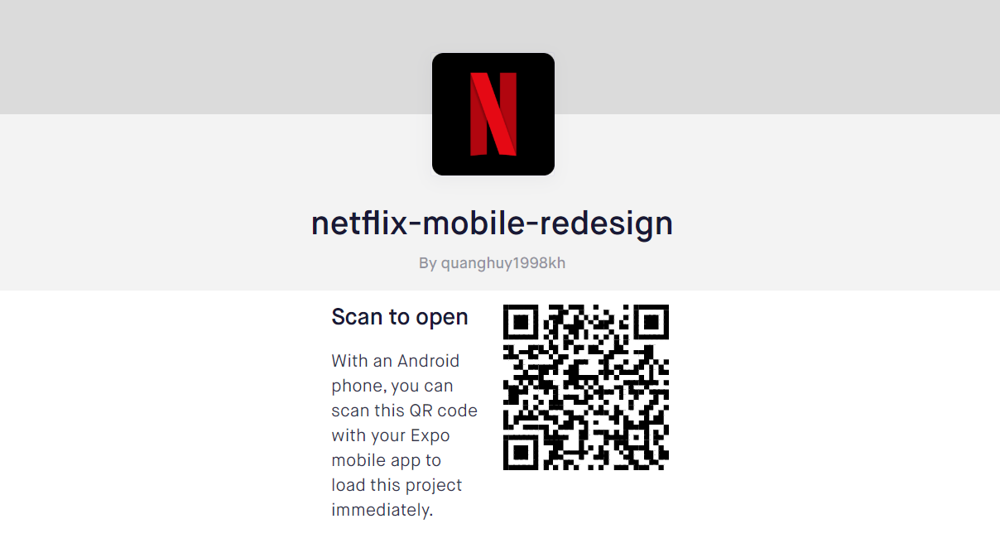
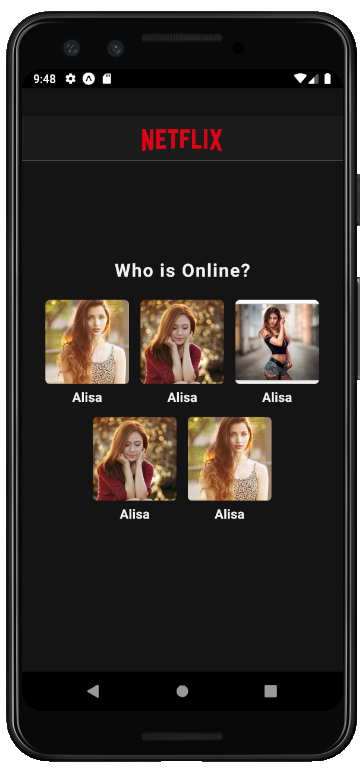
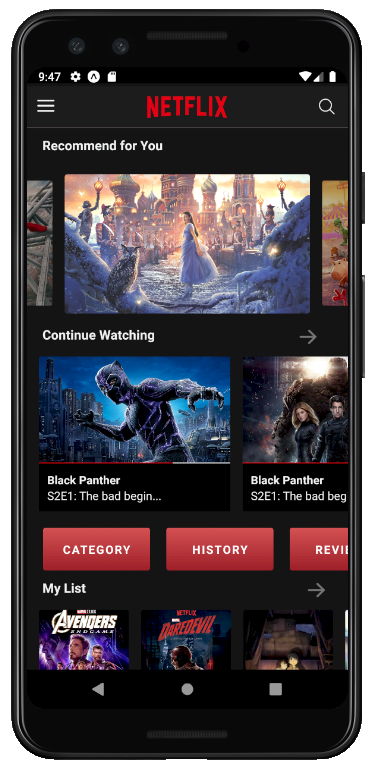
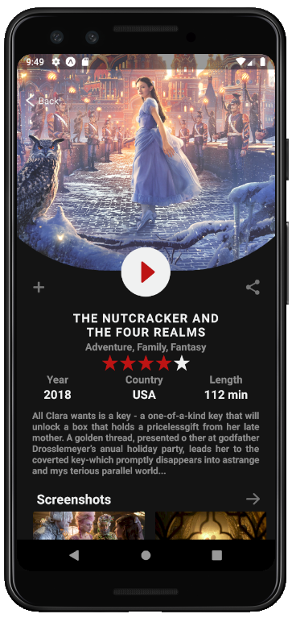
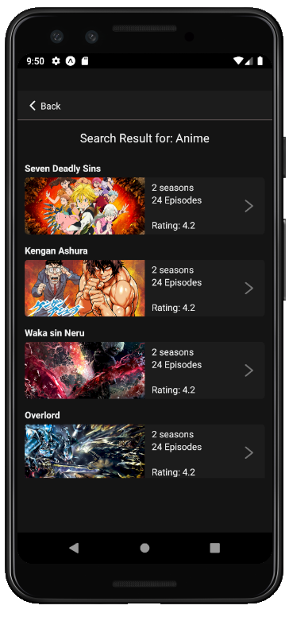
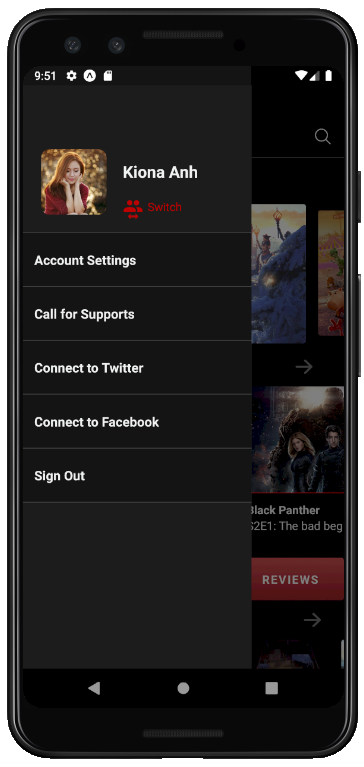
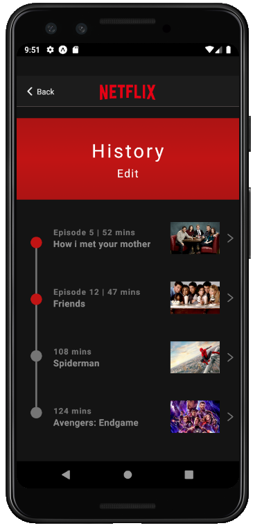
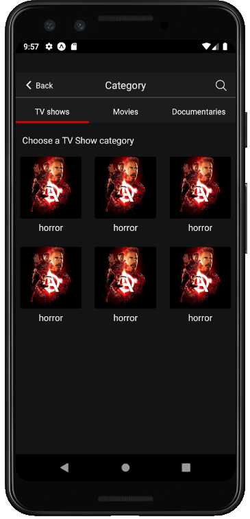
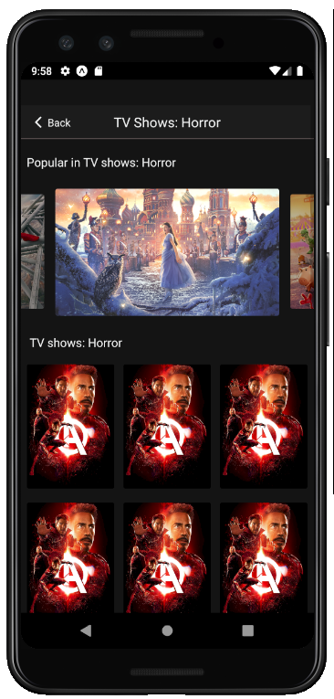

# Netflix Mobile Redesign
for website version, see [netflix-web-redesign](https://github.com/loia5tqd001/Clone-Netflix-SE215) 

<table style="width:100%">

<tr>
    <th> 

       
    
 </th>
    <th> 

       
    
 </th>
</tr>
<tr>
    <th> 

       
    
 </th>
    <th> 

       
    
 </th>
</tr>
<tr>
    <th> 

       
    
 </th>
    <th> 

       
    
 </th>
</tr>
<tr>
    <th> 

       
    
 </th>
    <th> 

       
    
 </th>
</tr>
</table>

